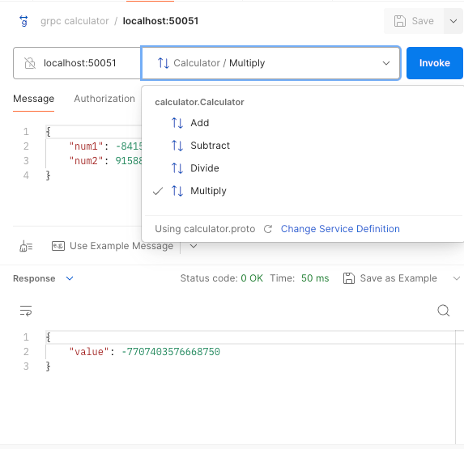
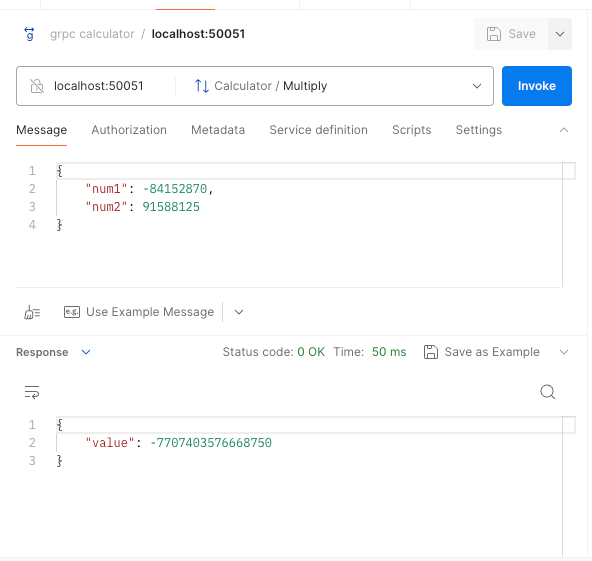

# basic_calculator
gRPC API service implementation for a basic calculator features

## command to compile the .proto file


```shell
python -m grpc_tools.protoc -I. --python_out=. --grpc_python_out=. calculator.proto
```

This will generate two files: calculator_pb2.py and calculator_pb2_grpc.py.

## Run server

```shell
 python calculator_server.py --port=50051
```
or
```shell
 python3 calculator_server.py --port=50051
 ```

## Run client

```shell
python calculator_client.py
```
or
```shell
python3 calculator_client.py
```

## server port

The server port is hardcoded to run
```python3
    server.add_insecure_port('[::]:50051')
```

## test using post man



