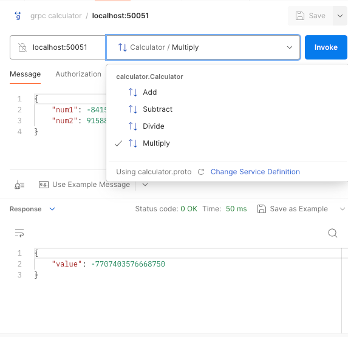
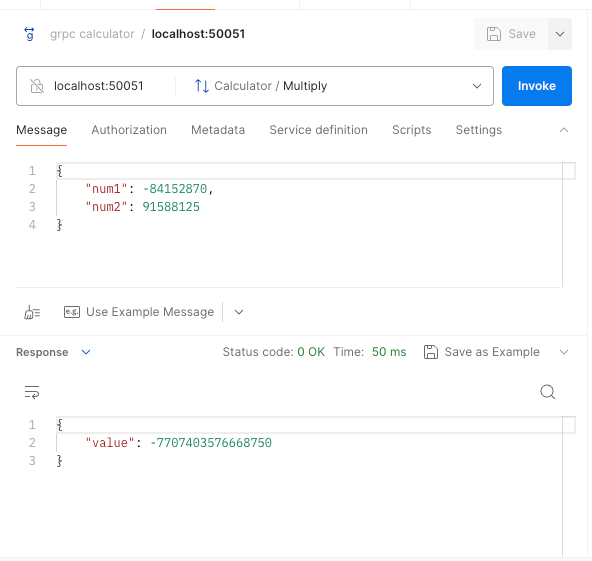

# basic_calculator
gRPC API service implementation for a basic calculator features using python3

## Prerequist
1. python3 environment
2. protobuf -> https://grpc.io/docs/protoc-installation/

## command to compile the .proto file

```shell
python3 -m grpc_tools.protoc -I. --python_out=. --grpc_python_out=. calculator.proto
```

This will generate two files: `calculator_pb2.py` and `calculator_pb2_grpc.py`.

## Run server
Command:
```shell
 python3 calculator_server.py --port=<port>
```
Example:
```shell
 python3 calculator_server.py --port=50051
 ```

## Run client
Command:
```shell
python3 calculator_client.py --port=<server_port>
```
Example:
```shell
python3 calculator_client.py --port=50051
```
### Test using test calculator_client.py

To test locally just run in the same machine where server is running

Provide the correct port details that the server is running

```shell
$ python3 calculator_client.py --port=50051
Add: 10 + 5 = 15.0
Subtract: 10 - 5 = 5.0
Divide: 10 / 5 = 2.0
```

## Test using post man
1. Load the `calculator.proto` file in postman.
2. Select the available methods `Add`, `Subtract`, `Divide` or `Multiply`.
2. In message pass the `num1` and `num2` and Invoke.
3. The calculated result is reseived as `value` in response.






